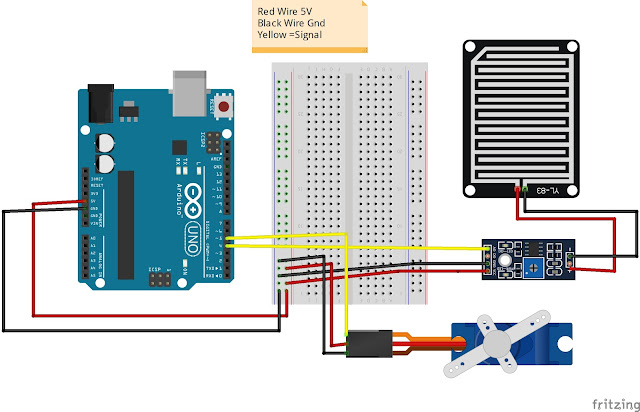

# 🧺 Smart Laundry Rack Off-Mode System

## 📖 Project Overview
The **Smart Laundry Rack Off-Mode System** is an IoT-based solution designed to automate and optimize laundry drying. It uses a rain sensor to detect rainfall and automatically moves the rack to a sheltered position. When the rain stops, the rack moves back out without requiring manual intervention. Mobile tracking is optional but can be enabled if needed.

## ✨ Features
- Automatic rack retraction based on rain detection.
- Automatic extension when rain stops.
- Manual override and mobile app control (optional).
- Energy-efficient "off mode" to conserve power.

## 🛠️ Hardware Requirements
- ESP32/ESP8266 microcontroller
- Rain sensor
- DC motor with motor driver
- Relay module
- Power supply unit
- Mechanical rack assembly

## ⚙️ System Architecture
1. **Rain sensor** detects rainfall.
2. **Microcontroller** processes sensor input.
3. **Actuators** move the laundry rack based on rain detection.
4. **Cloud platform** stores and analyzes data (optional).
5. **Mobile application** provides user interface and control (optional).

## 🚀 Installation & Setup
1. Install dependencies in Arduino IDE.
2. Upload the firmware to the microcontroller.
3. Connect the hardware components as per the circuit diagram.
4. Configure the mobile app for monitoring if required.

## ⚡ Working Principle
- The **rain sensor** detects rainfall and signals the microcontroller.
- The **microcontroller** activates the motor to retract the rack to a sheltered position.
- When the rain stops, the sensor signals the controller to extend the rack again.
- In **off mode**, the system minimizes power consumption by turning off non-essential components.
- Users can **manually control** the system via a mobile app if needed.

## 🔮 Future Improvements
- Integrate AI-based weather predictions.
- Add solar-powered functionality.
- Enhance mobile app with predictive drying time estimation.

<video controls src="assets/Working_model.mp4" title="Title" width="500" height="400"></video>

